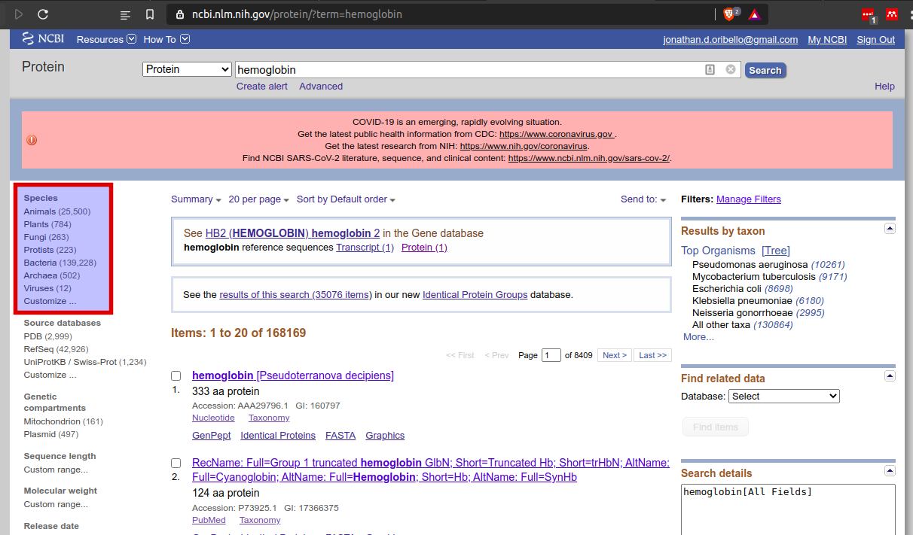
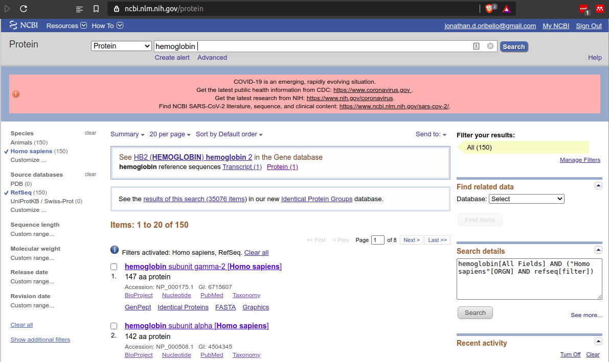

# Goals of this Manual
- Introduce researchers to retrieving protein sequences and structures
- Suggest best practices in retrieval and documentation
- Introduce Chimera and Chimera tutorials for exploring structures

### Assumptions
- The researcher understands the difference between protein primary, secondary, tertiary, and quaternary structures

## Accession Numbers
- Unique identifiers that describe a specific record (for our purposes, often a protein sequence or a protein structure)
- These are essential for allowing your research to be reproducible as they specify **exactly** what you are performing your analysis on.

## Obtaining Protein Sequences
Protein sequences can be obtained from a number of sources.  Keeping record of the exact entry being analyzed is **essential**.  This means recording the accession number of the entry and where the entry was obtained.

### NCBI
- "The National Center for Biotechnology Information advances science and health by providing access to biomedical and genomic information." - https://www.ncbi.nlm.nih.gov/

This is an excellent starting point for most research.  NCBI hosts a collection of databases including database linking annotations.

#### Searching NCBI Databases
Searching NCBI is relatively easy.  
For instance, searching for hemoglobin in humans with an interest in protein sequence can be performed as follows:

1. Search all databases using term "hemoglobin"

2. Notice, we get hits across many different databases.  Let's next click on the 'Protein' database results.

3. Let's filter to homo sapiens only (You may need to add them by clicking 'customize').

4. Finally, let's filter to only include RefSeq entries.

5. Selecting the first hit, you should see the following page, to download the fasta file, select the 'Send to' menu.

6. Choose 'File' as the destination and 'FASTA' as the format.  Clicking create file will launch the download.

#### RefSeq : Why it is the best option on among NCBI records
"The Reference Sequence (RefSeq) collection provides a comprehensive, integrated, non-redundant, well-annotated set of sequences, including genomic DNA, transcripts, and proteins. RefSeq sequences form a foundation for medical, functional, and diversity studies." - https://www.ncbi.nlm.nih.gov/refseq/about/

- When possible, a ReqSeq entry is preferred over identical non-RefSeq sequences.

### Sequences from RCSB
"This resource is powered by the Protein Data Bank archive-information about the 3D shapes of proteins, nucleic acids, and complex assemblies that helps students and researchers understand all aspects of biomedicine and agriculture, from protein synthesis to health and disease.
As a member of the wwPDB, the RCSB PDB curates and annotates PDB data.
The RCSB PDB builds upon the data by creating tools and resources for research and education in molecular biology, structural biology, computational biology, and beyond." - https://www.rcsb.org/

This is the source for experimentally determined protein structures.  We often need to use the sequence for a protein structure, so knowing how to retrieve this from the RCSB website is important.

1. Let's start here : https://www.rcsb.org/structure/1SI4. Our goal will be to get the sequence for this entry.

1. Select the dropdown menu for 'Download files', select FASTA sequence, this should launch the download.

#### Finding similar sequences
Analysis of protein structures will often include a search for similar proteins.  Knowledge about similar proteins may give insights into the protein of interest.  

"Similar" can mean one of two things: the **sequence** are similar or the **structure** is similar.  It is possible for proteins to be both similar in terms of sequence and structure, similar in only one regard, and, of course, neither similar in terms of sequence nor structure.

Scrolling down the 1SI4 entry, the links for  searching for similar sequences and structures are shown below **NOTE: this searches the RCSB PDB only, if you are looking for similar sequences that do not have a solved structure in the RCSB I would suggest Blast against non-redudant database**:

## Obtaining Protein Structures
- Protein structures can be obtained in a similar method as the Fasta sequence:

### PDB format
This is the primary file format for protein structures.  These are human-readable; however, we often deal with the data using program or scripts.

The exact format is documented here : http://www.wwpdb.org/documentation/file-format

**Note for Programming: Biopython has excellent PDB file parsing support, you should have a very specific reason for programming a parser, always avoid reinventing the wheel**

A quick aside: the mmCIF format is an alternate format for protein structures that will supersede the PDB format.  The RCSB offers both and will plan to offer both where possible in the future.  On a practical note, many tools have support for both; however, it is entirely possible to encounter tools designed solely for PDB format or mmCIF format (not encountered in my experience, but may be more common as mmCIF becomes both the de jure **and** de facto standard format)

### X-Ray vs Cryo-EM vs NMR
These are the main experimentally methods for determining protein structure.  In order of resolution (how clearly the atomic coordinates have been defined), X-ray is typically best, Cryo-EM yields moderate results and NMR often yields  low resolution structure ensembles (think multiple pictures of the protein but all fuzzy).

Everything else held constant, high resolution (meaning low Angstroms) is ideal and typically this means limiting study to X-ray structures (arguably modern Cryo-EM may also be included if the reported resolution is good enough).

### Missing Residues
Missing residues from the reference sequence are common in structure experiments.  This indicates either the residue was actually missing from the experiment or that the residue was present but too fuzzy to be located with enough precision.

**Note for Programmers: this is a big source of frustration if you do not have a strategy ahead of time.  I would suggest knowing how you want to handle 'missing' residues in the structure, specifically if and how you want to reconcile indices when a 'missing' residue is encountered**

### Exploring Structures in Chimera
Chimera is software for exploring protein structures through either the graphical interface or through scripts.  Chimera has a wide range of utilities and is also an excellent software for preparing publication ready images.

- Download and install here : [link](http://www.cgl.ucsf.edu/chimera/download.html)

- Excellent tutorial playlist : [Youtube](https://www.youtube.com/playlist?list=PLHib7JgKNUUeTZONxd0h0WBiZzAJmXmva)
